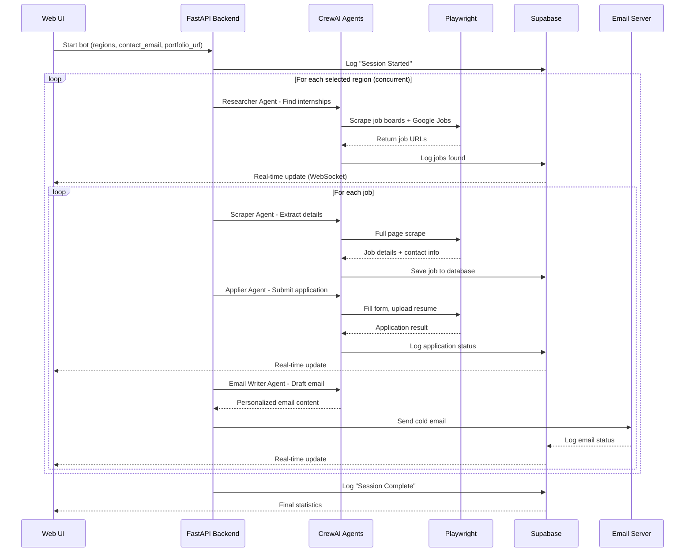

# Internship Automation Bot - Project Context

## 🎯 Project Overview

An AI-powered internship application automation bot that:
1. **Scrapes** internship listings from region-specific job boards and Google Jobs
2. **Automatically applies** to eligible positions using Playwright
3. **Sends personalized cold emails** to companies after applying
4. **Logs all activity** in real-time to a web UI and persists data to Supabase

---

## 🏗️ Architecture

```
┌─────────────────────────────────────────────────────────────────────┐
│                         WEB UI (Frontend)                           │
│   HTML/CSS/JavaScript - Modern, Real-time Dashboard                 │
│   - Region selection (EU, UK, Nigeria, Türkiye)                     │
│   - Contact email input (for companies to reach you)                │
│   - Portfolio URL input                                              │
│   - Start/Stop controls                                              │
│   - Real-time activity logs                                          │
│   - Companies found, applications sent, emails sent                  │
└─────────────────────────────────────────────────────────────────────┘
                                   │
                                   │ REST API (WebSocket for real-time)
                                   ▼
┌─────────────────────────────────────────────────────────────────────┐
│                      BACKEND (FastAPI + Python)                     │
│   - Receives UI configuration                                        │
│   - Orchestrates CrewAI agents                                       │
│   - Manages concurrent region scrapers                               │
│   - Emits real-time logs via WebSocket                              │
│   - Stores results to Supabase                                       │
└─────────────────────────────────────────────────────────────────────┘
                                   │
          ┌────────────────────────┼────────────────────────┐
          ▼                        ▼                        ▼
┌──────────────────┐    ┌──────────────────┐    ┌──────────────────┐
│   RESEARCHER     │    │     SCRAPER      │    │   EMAIL WRITER   │
│   AGENT          │    │     AGENT        │    │      AGENT       │
│ (Finds listings) │    │ (Extracts data)  │    │ (Drafts emails)  │
└──────────────────┘    └──────────────────┘    └──────────────────┘
          │                        │                        │
          ▼                        ▼                        ▼
┌──────────────────┐    ┌──────────────────┐    ┌──────────────────┐
│   APPLIER        │    │   COORDINATOR    │    │   SMTP Service   │
│   AGENT          │    │   AGENT          │    │   (Send emails)  │
│ (Fills forms)    │    │ (Orchestrates)   │    └──────────────────┘
└──────────────────┘    └──────────────────┘
          │
          ▼
┌──────────────────────────────────────────────────────────────────────┐
│                         PLAYWRIGHT (Stealth Mode)                    │
│   - Scrapes job boards (region-specific + Google Jobs)               │
│   - Fills application forms automatically                            │
│   - Avoids bot detection with stealth settings                       │
└──────────────────────────────────────────────────────────────────────┘
          │
          ▼
┌──────────────────────────────────────────────────────────────────────┐
│                         SUPABASE (PostgreSQL)                        │
│   - jobs: All found internships                                      │
│   - applications: Submitted applications                             │
│   - emails: Sent cold emails with status                             │
│   - activity_logs: Real-time activity stream                         │
└──────────────────────────────────────────────────────────────────────┘
```

---

## 🌍 Supported Regions & Job Boards

### EU (European Union)
| Job Board | URL | Notes |
|-----------|-----|-------|
| LinkedIn EU | linkedin.com/jobs | Filter by EU countries |
| Indeed EU | indeed.com (country-specific) | de.indeed.com, fr.indeed.com, etc. |
| Glassdoor EU | glassdoor.com | EU locations filter |
| EuroJobs | eurojobs.com | EU-specific |
| Graduateland | graduateland.com | European internships |

### UK (United Kingdom)
| Job Board | URL | Notes |
|-----------|-----|-------|
| Indeed UK | uk.indeed.com | Primary source |
| Graduate-Jobs | graduate-jobs.com | UK grad/intern roles |
| RateMyPlacement | ratemyplacement.co.uk | UK placements/internships |
| Prospects | prospects.ac.uk | UK careers site |
| Milkround | milkround.com | UK early careers |

### Nigeria
| Job Board | URL | Notes |
|-----------|-----|-------|
| Jobberman | jobberman.com/ng | Largest in Nigeria |
| MyJobMag | myjobmag.com | Pan-African |
| HotNigerianJobs | hotnigerianjobs.com | Nigeria-specific |
| NgCareers | ngcareers.com | Nigeria internships |

### Türkiye
| Job Board | URL | Notes |
|-----------|-----|-------|
| Kariyer.net | kariyer.net | Largest in Turkey |
| LinkedIn TR | linkedin.com/jobs | Turkish locations |
| Indeed TR | tr.indeed.com | Turkish market |
| Yenibiris | yenibiris.com | Turkish jobs |
| Secretcv | secretcv.com | Turkish jobs |

### Google Jobs Integration
- All regions will ALSO use Google Jobs with location filters
- Query format: `{keywords} internship 2025 site:linkedin.com OR site:indeed.com location:{region}`

---

## 📧 Cold Email System

### Dynamic Template Variables
The email template will dynamically substitute these variables for EACH company:

| Variable | Description | Example |
|----------|-------------|---------|
| `{{current_date}}` | Date of application | "January 3, 2026" |
| `{{company_name}}` | Target company | "Google" |
| `{{position_title}}` | Job title applied for | "Software Engineer Intern" |
| `{{hiring_manager}}` | Manager name (if found) | "Sarah Jones" or "Hiring Team" |
| `{{candidate_name}}` | Your name | "Anthony Ogbuah" |
| `{{candidate_year}}` | University year | "Junior" |
| `{{candidate_major}}` | Major | "Computer Science" |
| `{{top_skills}}` | Relevant skills for job | "Python, Machine Learning" |
| `{{personal_hook}}` | AI-generated custom hook | Based on job + skills match |
| `{{portfolio_url}}` | Your portfolio link | From UI input |
| `{{contact_email}}` | Email for replies | From UI input |

### Email Flow
1. Bot applies to job on company portal
2. Bot extracts company contact email (if available) OR uses generic careers@ email
3. Bot generates personalized email using template + AI
4. Bot sends email via SMTP
5. Log success/failure to Supabase

### Example Generated Email
```
Subject: Just Applied - Software Engineer Intern at Google | Anthony Ogbuah

Hi Google Hiring Team,

I just submitted my application for the Software Engineer Intern position today (January 3, 2026).

I'm Anthony, a Junior Computer Science major with hands-on experience in Python, Machine Learning, 
and building production systems. I was particularly drawn to Google's work on [specific project 
found in job description].

I've attached my resume and you can see my projects at: portfolio.example.com

Would love the opportunity to contribute to your team. Feel free to reach me at yourcontact@email.com.

Best,
Anthony Ogbuah
```

---

## 💾 Database Schema (Supabase)

### Table: `jobs`
```sql
CREATE TABLE jobs (
    id UUID PRIMARY KEY DEFAULT gen_random_uuid(),
    company TEXT NOT NULL,
    title TEXT NOT NULL,
    url TEXT UNIQUE NOT NULL,
    region TEXT NOT NULL, -- 'EU', 'UK', 'Nigeria', 'Turkiye'
    source TEXT, -- 'linkedin', 'indeed', 'google_jobs', etc.
    contact_email TEXT,
    hiring_manager TEXT,
    description TEXT,
    eligibility_verified BOOLEAN DEFAULT FALSE,
    status TEXT DEFAULT 'found', -- 'found', 'applied', 'emailed', 'rejected', 'interview'
    created_at TIMESTAMPTZ DEFAULT NOW(),
    updated_at TIMESTAMPTZ DEFAULT NOW()
);
```

### Table: `applications`
```sql
CREATE TABLE applications (
    id UUID PRIMARY KEY DEFAULT gen_random_uuid(),
    job_id UUID REFERENCES jobs(id),
    applied_at TIMESTAMPTZ DEFAULT NOW(),
    method TEXT, -- 'form_fill', 'quick_apply', 'manual'
    status TEXT DEFAULT 'submitted', -- 'submitted', 'confirmed', 'failed'
    notes TEXT,
    screenshot_url TEXT -- Optional: store screenshot of confirmation
);
```

### Table: `emails`
```sql
CREATE TABLE emails (
    id UUID PRIMARY KEY DEFAULT gen_random_uuid(),
    job_id UUID REFERENCES jobs(id),
    recipient_email TEXT NOT NULL,
    subject TEXT NOT NULL,
    body TEXT NOT NULL,
    sent_at TIMESTAMPTZ,
    status TEXT DEFAULT 'pending', -- 'pending', 'sent', 'failed', 'bounced'
    error_message TEXT
);
```

### Table: `activity_logs`
```sql
CREATE TABLE activity_logs (
    id UUID PRIMARY KEY DEFAULT gen_random_uuid(),
    timestamp TIMESTAMPTZ DEFAULT NOW(),
    level TEXT, -- 'INFO', 'SUCCESS', 'WARNING', 'ERROR'
    region TEXT,
    action TEXT, -- 'SEARCH', 'SCRAPE', 'APPLY', 'EMAIL', 'ERROR'
    message TEXT,
    metadata JSONB -- Additional context
);
```

---

## 🖥️ UI Specifications

### Main Dashboard Components

1. **Configuration Panel**
   - Region selector (multi-select dropdown): EU, UK, Nigeria, Türkiye
   - Contact email input (for companies to reply to you)
   - Portfolio URL input
   - Start/Stop/Pause buttons

2. **Statistics Cards**
   - Jobs Found (total, by region)
   - Applications Submitted (total, success rate)
   - Emails Sent (total, success rate)
   - Current Status (Running/Paused/Idle)

3. **Real-Time Activity Log**
   - WebSocket-powered live feed
   - Color-coded by action type (search=blue, apply=green, email=purple, error=red)
   - Filterable by region and action type
   - Auto-scroll with pause-on-hover

4. **Jobs Table**
   - Sortable/filterable DataTable
   - Columns: Company, Title, Region, Status, Applied, Emailed, Date
   - Click to expand for full details

5. **Settings/Config Panel**
   - Search keywords (editable)
   - Safety limits (max actions/day)
   - Email template preview/edit

### Design Requirements
- Dark mode by default (with toggle)
- Glassmorphism cards
- Smooth animations
- Real-time updates (no page refresh)
- Responsive (works on mobile for monitoring)

---

## 📁 Project File Structure

```
job_applier_bot/
├── .env                        # Environment variables (SMTP, Supabase, OpenAI)
├── .env.example                # Template for .env
├── .gitignore                  # Git ignore rules
├── PROJECT_CONTEXT.md          # This file
├── requirements.txt            # Python dependencies
├── main.py                     # Legacy CLI entry point
│
├── backend/                    # FastAPI Backend
│   ├── __init__.py
│   ├── app.py                  # FastAPI app, routes, WebSocket
│   ├── config.py               # Configuration management
│   ├── models.py               # Pydantic models
│   ├── database.py             # Supabase client
│   ├── websocket_manager.py    # Real-time log broadcasting
│   └── services/
│       ├── __init__.py
│       ├── job_scraper.py      # Region-specific scraping logic
│       ├── job_applier.py      # Form filling automation
│       ├── email_service.py    # Email composition & sending
│       └── orchestrator.py     # Coordinates all agents
│
├── frontend/                   # Web UI
│   ├── index.html              # Main HTML
│   ├── css/
│   │   └── styles.css          # Custom styles
│   └── js/
│       ├── app.js              # Main application logic
│       ├── websocket.js        # WebSocket client
│       └── charts.js           # Statistics visualization
│
├── src/                        # Existing CrewAI agents
│   ├── __init__.py
│   ├── agents.py               # Agent definitions
│   └── tools.py                # Tool implementations
│
├── config/
│   └── config.yaml             # User profile & search criteria
│
├── data/
│   ├── resume.pdf              # User's resume
│   └── jobs.db                 # Local SQLite (legacy, migrating to Supabase)
│
├── templates/
│   └── email_template.txt      # Email template
│
└── db/
    ├── __init__.py
    └── database.py             # Legacy DB helpers
```

---

## 🔐 Environment Variables

```env
# OpenAI (for CrewAI agents)
OPENAI_API_KEY=sk-...

# SMTP (for sending cold emails)
SMTP_USER=your-email@gmail.com
SMTP_PASSWORD=your-app-password
SMTP_SERVER=smtp.gmail.com
SMTP_PORT=587

# Supabase (for persistent storage)
SUPABASE_URL=https://your-project.supabase.co
SUPABASE_KEY=your-anon-key

# Application Settings
MAX_CONCURRENT_REGIONS=4
MAX_APPLICATIONS_PER_DAY=50
MAX_EMAILS_PER_DAY=50
```

---

## 🚀 Workflow: Fully Autonomous Mode



---

## ⚙️ Configuration (config.yaml)

```yaml
user_profile:
  name: "Anthony Ogbuah"
  email: "anthonyogbuah@gmail.com"  # This is for SMTP sending
  contact_email: ""                  # Filled from UI - for companies to reply
  portfolio_url: ""                  # Filled from UI
  university: "Your University"
  university_year: "Junior"
  major: "Computer Science"
  skills: 
    - Python
    - TypeScript
    - SQL
    - C/C++
    - Machine Learning
    - Deep Learning
    - Docker
    - Git
    - Assembly

paths:
  resume: "./data/resume.pdf"

search_criteria:
  keywords:
    - "Software Engineer Intern"
    - "AI Intern"
    - "Machine Learning Intern"
    - "Data Engineer Intern"
    - "Computer Engineer Intern"
    - "Embedded Systems Intern"
  target_year: "2025"
  eligible_years: ["Junior", "Senior", "3rd Year", "4th Year"]

regions:
  EU:
    enabled: false
    job_boards:
      - name: "LinkedIn"
        url: "https://www.linkedin.com/jobs/search/"
        search_params: "keywords={query}&location=European%20Union"
      - name: "Indeed DE"
        url: "https://de.indeed.com/jobs"
        search_params: "q={query}&l=Germany"
    google_location_filter: "Europe"
    
  UK:
    enabled: false
    job_boards:
      - name: "LinkedIn UK"
        url: "https://www.linkedin.com/jobs/search/"
        search_params: "keywords={query}&location=United%20Kingdom"
      - name: "Indeed UK"
        url: "https://uk.indeed.com/jobs"
        search_params: "q={query}"
      - name: "RateMyPlacement"
        url: "https://www.ratemyplacement.co.uk/search"
    google_location_filter: "United Kingdom"
    
  Nigeria:
    enabled: false
    job_boards:
      - name: "Jobberman"
        url: "https://www.jobberman.com/jobs"
        search_params: "q={query}"
      - name: "MyJobMag"
        url: "https://www.myjobmag.com/jobs"
    google_location_filter: "Nigeria"
    
  Turkiye:
    enabled: false
    job_boards:
      - name: "Kariyer.net"
        url: "https://www.kariyer.net/is-ilanlari"
        search_params: "q={query}"
      - name: "LinkedIn TR"
        url: "https://www.linkedin.com/jobs/search/"
        search_params: "keywords={query}&location=Turkey"
    google_location_filter: "Turkey"

safety:
  max_applications_per_day: 50
  max_emails_per_day: 50
  min_delay_between_actions_seconds: 5
  max_delay_between_actions_seconds: 15
  require_human_approval: false  # Autonomous mode
```

---

## 🛠️ Tech Stack Summary

| Component | Technology |
|-----------|------------|
| Backend Framework | FastAPI (Python 3.11+) |
| AI/Agents | CrewAI + LangChain + GPT-4o |
| Web Scraping | Playwright (with stealth mode) |
| Frontend | Vanilla HTML/CSS/JavaScript |
| Real-time | WebSockets (native) |
| Database | Supabase (PostgreSQL) |
| Email | SMTP (Gmail/custom) |
| State Management | Backend maintains state |

---

## 📝 Next Steps

1. ✅ Project context documented
2. ⬜ Create Supabase tables (user provides credentials)
3. ⬜ Build FastAPI backend with WebSocket support
4. ⬜ Create modern web UI dashboard
5. ⬜ Integrate existing CrewAI agents
6. ⬜ Implement region-specific scrapers
7. ⬜ Add cold email service with dynamic templates
8. ⬜ Test full autonomous workflow
9. ⬜ Deploy (optional)

---

## 🔗 User-Provided Information (To Fill)

| Field | Value | Status |
|-------|-------|--------|
| Portfolio URL | _(to be provided)_ | ⏳ Pending |
| Supabase URL | _(add to .env)_ | ⏳ Pending |
| Supabase Key | _(add to .env)_ | ⏳ Pending |
| University Name | _(to be provided)_ | ⏳ Pending |

---

*Last Updated: January 3, 2026*
